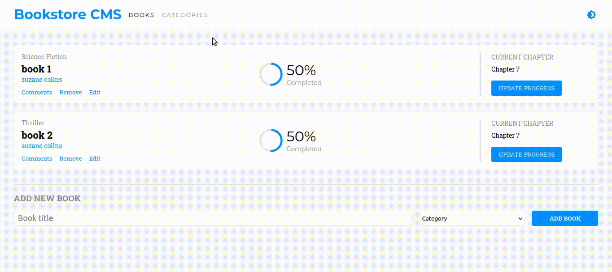

# Book Store

This is a website to Display a list of books using an API, you can also add new book and removing it.

## Built With

- HTML
- CSS
- ReactJS
- Redux

## Getting Started

start by cloning the repository.

`git clone https://github.com/rachidelaid/Bookstore-reactjs.git`

cd to the folder.

`cd Bookstore-reactjs`

install all the dependencies.

`npm install`

run the live server

`npm run start`

go to [http://localhost:8080](http://localhost:3000)

build the distribution folder before hosting the app

`npm run build`

after the build you can host the `build` folder.

## Authors

👤 **Rachid El aid**

- GitHub: [@rachidelaid](https://github.com/rachidelaid)
- Twitter: [@rachidelaid1](https://twitter.com/rachidelaid1)
- LinkedIn: [Rachid El aid](https://www.linkedin.com/in/rachid-elaid-106336203/)

## 🤝 Contributing

Contributions, issues, and feature requests are welcome!

Feel free to check the [issues page](../../issues/).

## Show your support

Give a ⭐️ if you like this project!
